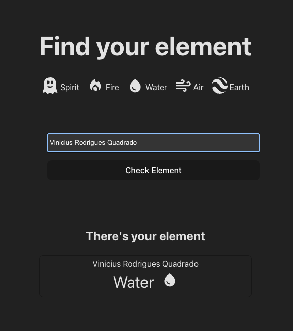

# What's the element name accounding to numerology?!

> **The challenge consist on get a person's name element using numerology logic.**

###The logic
The result on the complete calculation must be from 0 to 9, that's why two digits results must be summed until 0-9 result.

**Each letter has a numeric value.**

On the complete name, each **word value is calculated** following the rule to have a 0-9 result.

From this final number we know the element using numerology

Elements and its Numbers:
<table style="margin:auto;width:100%;margin:auto;max-width:700px;">
  <thead>
    <tr>
      <th>Element Name</th>
      <th>Numbers</th>
    </tr>
  </thead>
  <tbody>
    <tr>
      <td>Spirit</td>
      <td>0 | 9</td>
    </tr>
    <tr>
      <td>Fire</td>
      <td>1 | 5</td>
    </tr>
    <tr>
      <td>Water</td>
      <td>2 | 6</td>
    </tr>
    <tr>
      <td>Air</td>
      <td>3 | 7</td>
    </tr>
    <tr>
      <td>Earth</td>
      <td>4 | 8</td>
    </tr>
  </tbody>
</table>
Demo on the solution developed:

